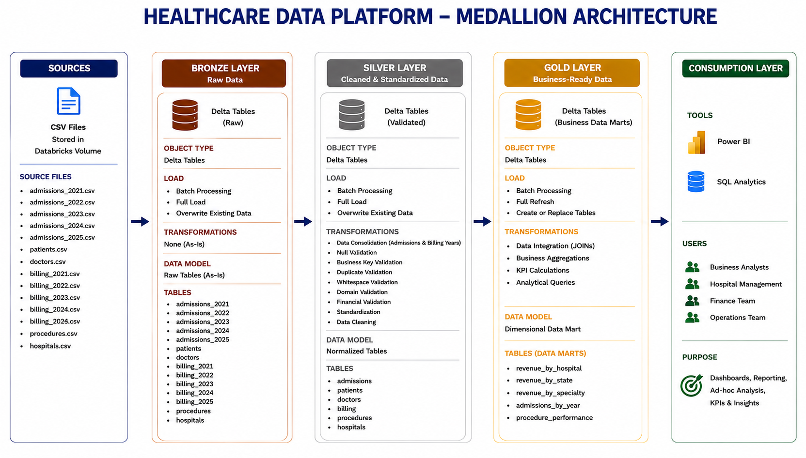
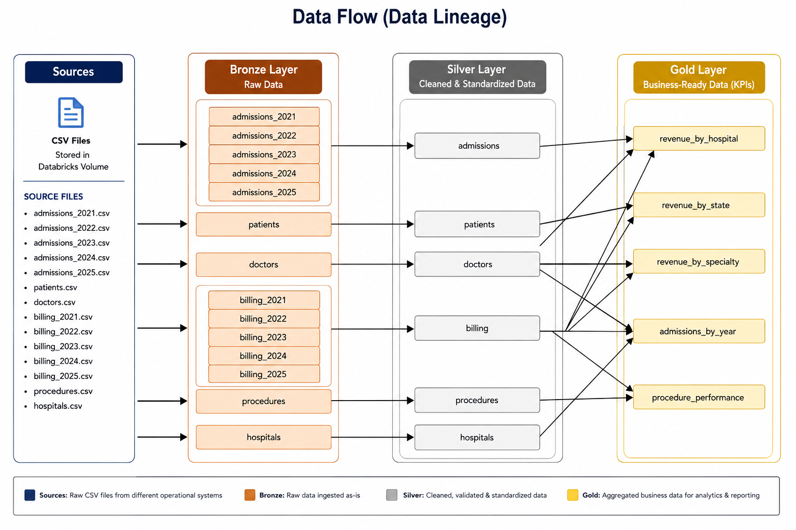

# 🏥 Healthcare Data Engineering Pipeline

An end-to-end **Healthcare Data Engineering Pipeline** built using **Databricks**, **PySpark**, **Spark SQL**, and **Delta Lake**, following the **Medallion Architecture (Bronze → Silver → Gold)**.

The project demonstrates how raw healthcare data can be ingested, validated, transformed, and modeled into business-ready datasets for analytics and reporting.

---

# 📖 Project Overview

Healthcare organizations generate large volumes of operational and financial data. This project implements a modern **Lakehouse architecture** that transforms raw CSV files into trusted analytical datasets suitable for business intelligence tools such as **Power BI**.

The pipeline consists of three layers:

- 🥉 Bronze – Raw data ingestion
- 🥈 Silver – Data cleaning and validation
- 🥇 Gold – Business-ready KPIs

---

# 🏗 Architecture



The project follows the Medallion Architecture:

```
CSV Files
     │
     ▼
Bronze Layer
     │
     ▼
Silver Layer
     │
     ▼
Gold Layer
     │
     ▼
Power BI
```

---

# 📂 Project Structure

```
healthcare-data-engineering-pipeline/
│
├── data/
│
├── docs/
│   ├── Architecture.png
│   ├── Data_Flow.png
│   ├── Integration_Model.png
│   ├── data_catalog.md
│   └── naming_conventions.md
│
├── scripts/
│   ├── bronze/
│   │   └── bronze_layer.ipynb
│   │
│   ├── silver/
│   │   ├── ehr/
│   │   ├── billing/
│   │   └── master_data/
│   │
│   └── gold/
│
└── README.md
```

---

# 🛠 Technologies

- Databricks
- Delta Lake
- PySpark
- Spark SQL
- Git
- GitHub
- Power BI (Reporting)

---

# 📁 Data Sources

The project uses healthcare datasets stored as CSV files.

### Clinical Data

- Patients
- Doctors
- Admissions

### Master Data

- Hospitals
- Procedures

### Financial Data

- Billing

---

# 🥉 Bronze Layer

### Purpose

Stores raw healthcare data exactly as received from the source files.

### Processing

- CSV ingestion
- Delta table creation
- Full Refresh (Overwrite)

---

# 🥈 Silver Layer

### Purpose

Transforms raw data into trusted datasets through validation and standardization.

### Data Quality Checks

- Null Validation
- Duplicate Validation
- Business Key Validation
- Whitespace Validation
- Domain Validation
- Financial Validation
- Data Standardization

### Output Tables

- admissions
- billing
- patients
- doctors
- hospitals
- procedures

---

# 🥇 Gold Layer

### Purpose

Provides business-ready datasets optimized for analytics and reporting.

### Business KPIs

| Table | Business Question |
|--------|-------------------|
| revenue_by_hospital | Which hospitals generate the highest revenue? |
| revenue_by_state | Which states generate the highest revenue? |
| revenue_by_specialty | Which medical specialties generate the highest revenue? |
| admissions_by_year | How are admissions changing over time? |
| procedure_performance | Which medical procedures are performed most frequently? |

---

# 🔗 Data Integration

The project integrates healthcare entities through business keys.


Relationships include:

- Admissions → Patients
- Admissions → Doctors
- Admissions → Hospitals
- Admissions → Procedures
- Billing → Admissions

---

# 📊 Data Flow



```
CSV Files
      │
      ▼
Bronze
      │
      ▼
Silver
      │
      ▼
Gold
      │
      ▼
Power BI
```

---

# 📚 Documentation

Additional documentation is available in the `docs` folder.

| Document | Description |
|----------|-------------|
| data_catalog.md | Gold layer data dictionary |
| naming_conventions.md | Naming standards used throughout the project |
| Architecture.png | Medallion Architecture |
| Integration_Model.png | Table relationships |
| Data_Flow.png | Pipeline flow |

---

# 🚀 Future Improvements

Potential enhancements include:

- Incremental data loading
- Delta Live Tables
- Databricks Workflows
- Automated pipeline scheduling
- Power BI dashboard
- Data quality monitoring
- Unit testing for data pipelines

---

# 👨‍💻 Author

Healthcare Data Engineering Pipeline

Built using Databricks Lakehouse, PySpark, Spark SQL, and Delta Lake.
